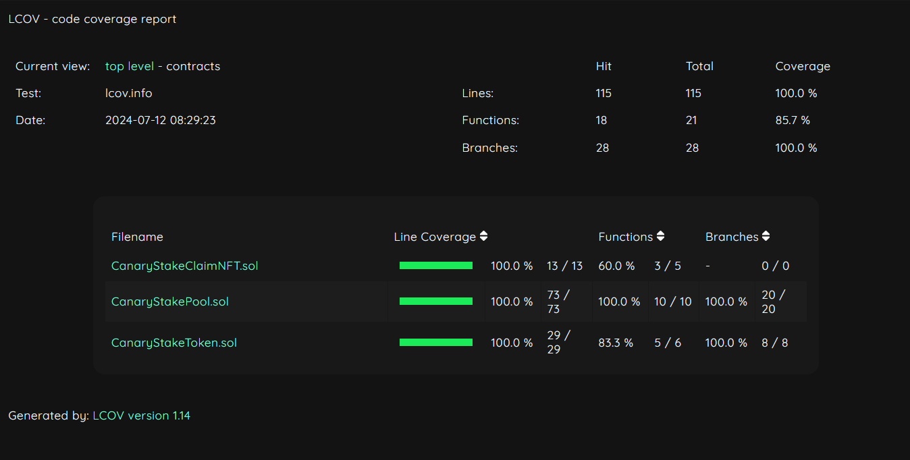
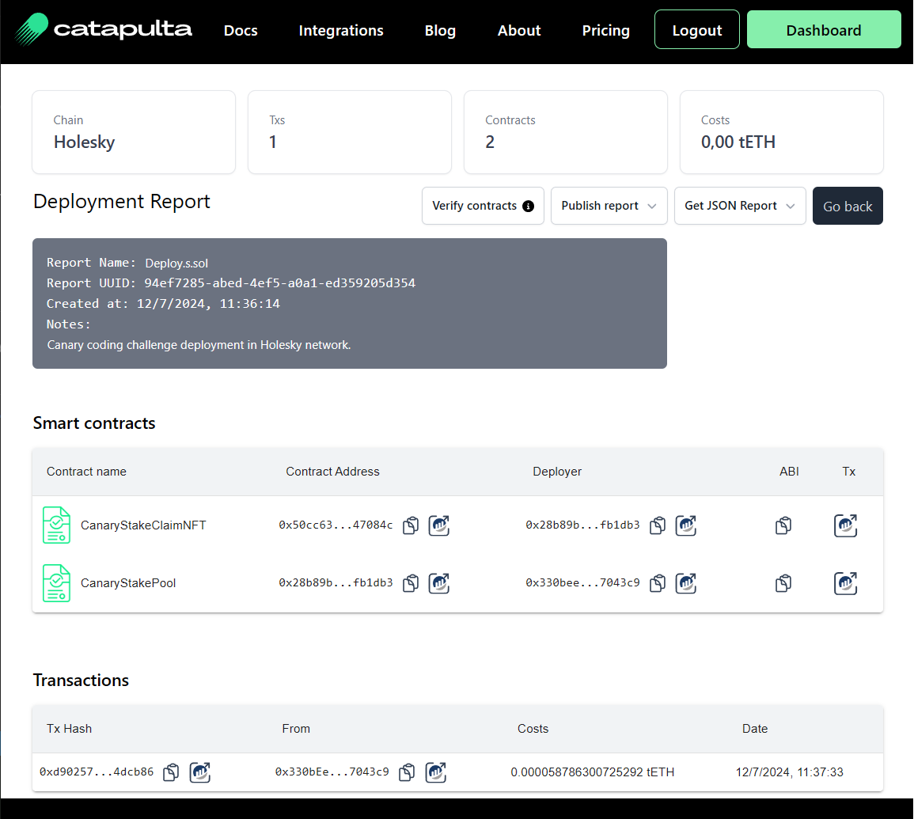

# <h1 align="center"> Canary Coding Challenge </h1>

The coding challenge aims to create a Staking Contract factory, using multiple tokens and withdrawal periods.

This project uses [Foundry](https://getfoundry.sh) and [Catapulta](https://catapulta.sh/docs), a smart contracts deployment platform.

## Security Notice
Please be aware, do NOT attempt to use this code in production in any circumstances, due is not audited by any third party, does not contain static formal verification and is not intended for production usage.

## Content

This Foundry repository contains the following contracts:
- `CanaryStakePool` is a  `Staking Pool ERC4626 factory`  with multiple tokens support, that allows an admin to whitelist a token and allow users to stake whitelisted tokens and get a "staked token" in return. The vault factory gives a fixed 5% APY (500bps) to the participants, and the admin needs to periodically deposit yield `adminYieldDeposit()` (can be weekly, daily, or any timeframe).
    - Deposit: users can deposit any whitelisted token with "1-week" or "4-week" notices. The contract will mint a ERC4626 token to represent the user positions, ex `CANARY-STETH-1-WEEK`, if is the first deposit. 
    - RequestWithdraw: users if request to withdraw, the contract will mint a NFT token that represents 
- `CanaryStakeClaimNFT`, a NFT that represents the owed funds from users that calls `requestWithdraw`, and holds the notice period, the claim amount, token claim address, and the claim timestamp.
- `CanaryStakeToken` a basic ERC4626, owned by `CanaryStakePool`. During token deposit to stake, if the stake token is not created, CanaryStakePool deploys a new `CanaryStakeToken`. Users can freely use their staked/wrapped tokens in DEXs or lending protocols due they follow the ERC20 standard.


Interfaces:
- CanaryStakePool contract follows `ICanaryStakePool` interface, stored Custom Errors in `ICanaryStakePoolErrors` and Events in `ICanaryStakePoolEvents` for easier testing and readability.
- IERC20, IERC4626 standard interfaces.

Utilities and libraries used:
- [Solmate](https://github.com/transmissions11/solmate) for gas optimized versions of ERC20, ERC721 and ERC4626 standards.
- Base64 from Vectorized, and Pausable from OpenZeppelin.

#### Assumptions
- The admins needs to send funds in a weekly manner via `adminYieldDeposit`, per whitelisted token. The `CanaryStakePool` contains a read only function to calculate the missing rewards in the CanaryStakePool. The rewards in form of the underlying token are sent directly to the wrapped staked vault ERC4626, causing "inflation" and rewarding all stk token holders.
-  There is no emergency recovery functions, due is not specified in the challenge but would be desirable to have a time-lock withdrawal function in case is needed for recovery.
- There is no proxy pattern involved, due is not specified in the challenge. Proxy pattern could help to keep rolling new updates without painful migrations, and can also boost security in case of a vulnerability, if the proxy admins are owned by a timelock, multisig, or DAO-like governance contracts.

### Coverage
The repository contains 100% test coverage of the lines, but still there could be improvements like fuzzing tests, invariant testing or more in-deep testing of custom scenarios.



## Requirements

- [Git](https://gist.github.com/derhuerst/1b15ff4652a867391f03)
- [Node.js](https://gist.github.com/d2s/372b5943bce17b964a79)
- [Foundry](https://book.getfoundry.sh/)

## Getting Started

Compile contracts
```
forge compile
```

Run tests
```
forge test
```

Run tests coverage
```
make coverage
```

Deploy with Forge, locally
```
forge script script/Deploy.s.sol
```

Deploy with Forge, in holesky, using [Foundry keystore accounts](https://medium.com/@RyanHolanda/enhancing-security-and-efficiency-a-guide-to-using-account-in-foundry-b18a120bb3f2)
```
forge script script/Deploy.s.sol broadcast --rpc-url <holesky-rpc-endpoint> --account <keystore-account-name>
```

[Deploy with Catapulta](https://catapulta.sh/blog/deploy-without-gas-foundry-catapulta) in Holesky network
```
catapulta script script/Deploy.s.sol --network holesky --sponsor --account <account-name>
```
In the [previous link](https://catapulta.sh/blog/deploy-without-gas-foundry-catapulta) you can see a tutorial how to setup Catapulta, if you wish.

Catapulta generates deployment reports [like this one](https://catapulta.sh/report/94ef7285-abed-4ef5-a0a1-ed359205d354) for your team and keep tracks of all past deployments.



